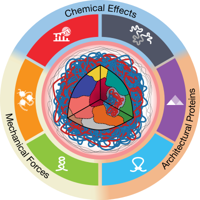

# Understanding and Engineering Chromatin as a Dynamical System across Length and Timescales

This repository contains the original SVG vector versions of the figures that appear in:
Johnstone et al., __Understanding and Engineering Chromatin as a Dynamical System across Length and Timescales__, Cell Systems (2020), [https://doi.org/10.1016/j.cels.2020.09.011](https://doi.org/10.1016/j.cels.2020.09.011).

The [releases page](https://github.com/GallowayLabMIT/cds_review_figures/releases) contains PDF and AI vector versions of the figures, as well as high resolution (400 dpi) PNG versions of the figures.

## License
Like the parent paper, all figures are released under the [Creative Commons Attribution 4.0 International (CC BY 4.0)](https://creativecommons.org/licenses/by/4.0/) license. In short, this allows you to copy, remix, transform, and build upon these figures *as long as the paper is cited*. If modified/copied/etc outside of an academic paper, the CC-BY-4.0 license should be linked and any modifications noted. See the above link for further details about this license.
